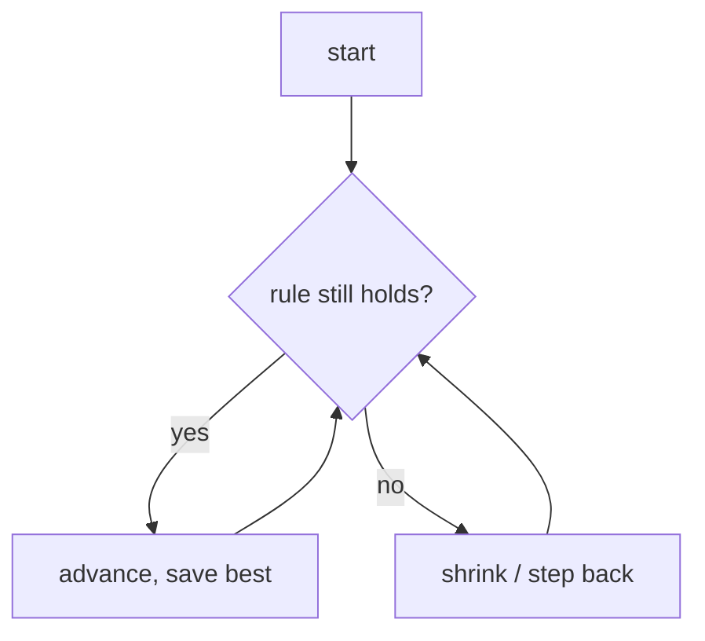

# ts-algorithms

Notes for engineers who can **code** (loops, arrays, objects) but never studied algorithms.

Two goals:

1. **Recognize** which trick a problem needs — so you stop memorizing solutions.
2. **Read** algorithms in the wild — spot them in a code review, in any stack (frontend or backend), and judge whether they're the right call.

---

## How to read a note

Every note follows the same order — the order you'd use on a real problem:

1. **What it is** — the one rule that defines it
2. **Spot it** — in a problem, and in real code
3. **What you track** — the variables / data
4. **How it works** — plain steps
5. **Picture** — a diagram
6. **Two disguises** — same trick, unrelated problems
7. **Questions to ask**
8. **Go faster**

---

## "Fast" vs "slow" — Big-O without the math

You'll see things like `O(n)` and `O(n²)`. You don't need the math — just a feel for how the work grows as the list gets bigger. In code terms:

| You'll see | What it is in code | When the list **doubles** |
|---|---|---|
| **O(1)** | no loop — one direct step (`arr[0]`, look up a key) | nothing changes — always instant |
| **O(log n)** | each step throws away **half** what's left (like "higher / lower" guessing) | barely grows — a million items finishes in ~20 steps |
| **O(n)** | one `for` loop over the list | work doubles too — fine |
| **O(n log n)** | sort first, then one loop | a bit more than doubles — the realistic target for most problems |
| **O(n²)** | a `for` loop **inside** another (compare everything to everything) | work goes up **4×** — falls apart on big lists |

**Why this is the first thing to check:** the problem almost always tells you the input size. If it says *"up to 100,000 items,"* the loop-inside-a-loop (`O(n²)`) version is ~10 billion steps — too slow. That line isn't decoration; it's the hint that a smarter trick exists. Pick your target speed **before** you write code.

---

## Map of tricks

Arrows mean **"this one = the one above it, plus one extra rule."** Sliding Window is just Two Pointers with a rule for moving the markers, so it nests under it. Folders match the map.

```mermaid
graph TD
    TP[Two Pointers: two markers walking a list] --> SW[Sliding Window]
    TP --> FS[Fast & Slow Pointers]
    TP --> CP[Two Markers From Both Ends]
    TP --> M2[Merge Two Sorted Lists]

    BS[Binary Search: keep halving] --> SA[Guess-and-Check the Answer]
    BS --> RA[Search a Rotated List]

    HASH[Hashing: a lookup table] --> FC[Counting Things]
    HASH --> TS[Two Sum]
    HASH --> AG[Grouping Anagrams]

    ST[Stack: last-in first-out pile] --> MS[Monotonic Stack]
    ST --> PM[Matching Brackets]

    HEAP[Heap: always-pop-the-smallest box] --> TK[Top-K]
    HEAP --> MK[Merge K Lists]
    HEAP --> TH[Running Median]

    RB[Recursion & Backtracking: try, undo, try again] --> SP[All Subsets / Orderings]
    RB --> CS[Puzzle Solving]
    RB --> MEMO[Remember Past Answers]
    MEMO -.turns into.-> DP

    DP[Dynamic Programming: build on smaller answers] --> D1[1-D]
    DP --> D2[Grid]
    DP --> KS[Pick Items Under a Limit]
    DP --> IV[Ranges]

    GR[Graphs: dots connected by lines] --> GBFS[Explore Ring by Ring]
    GR --> GDFS[Explore One Path Deep]
    GR --> TOPO[Order by Dependencies]
    GR --> UF[Who's Connected to Who]
    GR --> SHP[Cheapest Path]

    TR[Trees: a branching family chart] --> TDFS[Go Deep]
    TR --> TBFS[Go Level by Level]
    TR --> BST[Sorted Tree]
```



Helpers that show up _inside_ many of these: **Prefix Sum** (running totals), **Intervals** (start/end ranges), **Bit Manipulation** (toggling 0s and 1s), **Greedy** (grab the best-looking option right now).

### Folders match the map

Each leaf is a folder with its own `README.md`. The parent trick is the folder; variations nest inside.

```text
two-pointers/
  sliding-window/
  fast-slow-pointers/        # also used in linked-list problems — link, don't copy
  two-markers-both-ends/
  merge-two-sorted/
binary-search/
  guess-the-answer/
  rotated-list/
hashing/
  counting/
  two-sum/
  grouping-anagrams/
stack/
  monotonic-stack/
  matching-brackets/
heap/
  top-k/
  merge-k-lists/
  running-median/
recursion-backtracking/
  subsets-orderings/
  puzzle-solving/
dynamic-programming/         # "remember past answers" lives here
  one-d/
  grid/
  pick-under-limit/
  ranges/
graphs/
  ring-by-ring/
  deep-path/
  order-by-dependencies/
  whos-connected/
  cheapest-path/
trees/
  go-deep/
  level-by-level/
  sorted-tree/
prefix-sum/
intervals/
bit-manipulation/
greedy/
```

**Rule:** each trick lives in **one** folder. Fits two families? Pick the real parent and **link** from the other — never copy.

---

## Note template

Every `<family>/<trick>/README.md` answers these 8, in order. Plain words. Skip nothing.

````markdown
# <Trick name>

## 1. What it is
One line: "<parent> plus <the extra rule>."
(e.g. "Two markers, but the gap between them is a window we grow and shrink under a rule.")

## 2. Spot it
You meet this trick two ways — write the giveaways for both.

**In a problem:** the phrases / shapes that should fire it.
- e.g. "longest run with no repeats", "best 5 in a row", sorted list + "find a pair".

**In real code** (reviewing a PR — any stack): what it looks like written out.
- Frontend: e.g. a `start` index that only moves forward while scanning events → a window
  (debounce/throttle buffers, virtualized-list ranges, infinite-scroll page math).
- Backend: e.g. dropping old timestamps off the front of a list to count recent hits → the
  same window (rate limiters, log/stream scanning, moving averages).
- Smell test: is this O(n²) loop-in-a-loop doing work a single pass could?

## 3. What you track
The variables / data, and why — in terms you know:
- two indices (`left`, `right`); a running total; an object as a counter (`counts[x]`); a list used as a pile.

## 4. How it works
Recipe steps. Someone who can write a `for` loop should follow it:
> 1. ...
> 2. ...

## 5. Picture
Mermaid flowchart of the loop and how its state moves:



## 6. Two disguises
Two unrelated problems, same trick — this is what wires recognition.
- A (e.g. text): how it maps.
- B (e.g. money / traffic / scores): same trick, different story.

## 7. Questions to ask
**Skip** (already in the prompt): "what's a subarray?"
**Ask** (scopes it fast): empty or one item? negatives / duplicates? how big? mutate in place or return new?

## 8. Go faster
- The loop skeleton you keep ready to type.
- The one rule that must stay true every step (the invariant).
- Usual bugs here (off-by-one, empty case).
- State the cost out loud first: "O(n), one pass, two markers."
````

---

## Questions that work on almost anything

When unsure what to ask, these scope fast and signal experience:

| Ask early | Why it helps |
|---|---|
| "How big can the input get?" | Says whether the slow obvious way is good enough. |
| "Can it be empty, or one item?" | Where bugs hide. |
| "Sorted? Duplicates? Negatives?" | Each answer points at a different trick. |
| "Mutate in place, or return new?" | Decides your memory budget. |
| "One answer, or all of them?" | One → often greedy. All → usually try-everything. |
| "Data all up front, or streaming in?" | Streaming needs different tools. |

**Don't** re-ask what the prompt says, or ask "what approach should I use?" Restate the problem in your own words first — that alone catches half the misunderstandings.
