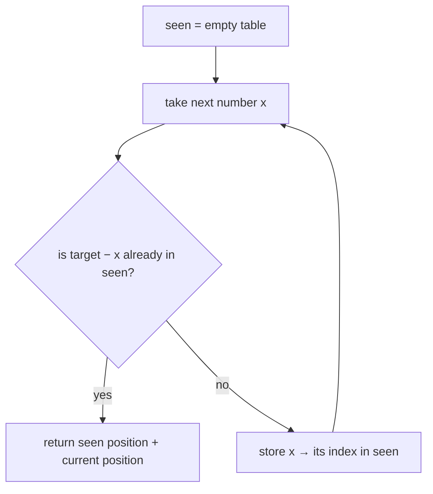

# Two Sum — the "have I seen what I need?" table

## 1. What it is
A single loop **plus a hashmap that remembers what you've already seen** — so the
answer becomes one instant lookup instead of a second loop.

> Built on: **Hashing** (a lookup table). The extra rule: as you walk the list once,
> write down each item you've seen; before moving on, ask the table for the exact
> partner you still need.

> ⚖️ **Sorted input? Don't reach for this.** If the array is already sorted, two
> converging pointers solve the same pair-sum in **O(1)** space — see the sibling note
> [`two-pointers/two-markers-both-ends`](../../two-pointers/two-markers-both-ends/README.md).
> The hashmap is what an **unsorted** input forces. Same question, different trick.

## 2. Spot it
**In a problem:**
- "find two things that add up to `X`" → the partner you need is `X − current`.
- "is there a duplicate?", "first repeated item", "have we seen this before?".
- You catch yourself wanting to **loop a second time just to look something up** — that itch is the tell.

**In real code** (reviewing a PR — any stack):
- Frontend: deduping a list by `id` with a `Set`/`Map` before render; memo caches keyed by input; "have I already fetched this?" guards.
- Backend: idempotency / replay protection (store processed request IDs, reject if seen); counting occurrences (`counts[key] = (counts[key] ?? 0) + 1`); joining two datasets by key instead of a nested loop.
- Smell test: a nested loop whose **inner loop only hunts for one matching value** → replace the inner loop with a hashmap. O(n²) → O(n).

## 3. What you track
- one hashmap (`Map` or plain object): **key = the thing you've seen**, value = what you want back.
- pairs that sum to a target → `seen[value] = index`.
- duplicate detection → a `Set` of seen keys (you only need "yes/no").

## 4. How it works
Recipe (Two Sum):
> 1. Make an empty table `seen`.
> 2. Walk the list one number at a time.
> 3. The partner you need for the current number is `target − number`.
> 4. If `seen` already holds that partner → done, return both positions.
> 5. Otherwise write down `number → its index` in `seen`, and move on.
> 6. One pass. No second loop.

**Why one pass is enough (the part that trips people up):** you check *before* you
store. If a valid pair exists, the **second** number of that pair is the one that
finds the **first** (already sitting in the table). So you never miss a pair, and you
never accidentally pair a number with itself.

## 5. Picture


## 6. Two disguises
Same trick, two problems that look unrelated.

- **A — LeetCode #1 Two Sum** (numbers): given `nums` and `target`, return the indices
  of the two numbers that add up to `target`. Mapping: the table is `value → index`;
  the "partner I need" is `target − nums[i]`.
- **B — Webhook replay guard** (backend / streaming): a receiver gets a stream of
  events, each with an `eventId`. Return the **first event that is a repeat** (a
  replay attack), or `null` if all are unique. Mapping: same table, used as a `Set`
  of seen ids — for each event, "have I seen this id?" The "partner I need" is just
  *the same id again*. Different story (security), identical trick at its core:
  **a hashmap so each "have I seen it?" is instant.**

## 7. Questions to ask
Only the trick-specific ones (generic scoping lives in the repo README):
- "Exactly one answer, or could there be many / none?"
- "Can I reuse the same element?" (Two Sum: no.)
- "Can values be negative or huge?" (a hashmap shrugs — a counting *array* would not.)
- "Do you want the indices, or the values themselves?"

## 8. Go faster
- Skeleton you keep ready:
  ```ts
  const seen = new Map<number, number>();
  for (let i = 0; i < nums.length; i++) {
    const need = target - nums[i];
    if (seen.has(need)) return [seen.get(need)!, i];
    seen.set(nums[i], i);
  }
  ```
- Invariant: **every item before the current one is already in `seen`.**
- Trick-specific bugs: storing *before* checking (lets a number match itself); the
  duplicate case like `[3,3]` (works only because you store as you go).
- Say the cost out loud first: **"O(n) time, O(n) space, one pass."**

---

Solution code (both disguises, fully commented): [`solution.ts`](./solution.ts).
