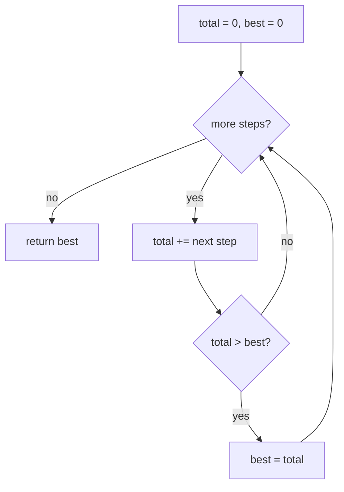

# Running total, keep the best

## 1. What it is
You're walking a list of step-by-step changes and you want the **highest point you
ever reach** while adding them up. You don't need to remember every point — just two
numbers: where you are **now** (a running total) and the **best** total you've seen.
Add each step to the running total; whenever it beats your best, update the best.

`gain = [-5, 1, 5, 0, -7]`, starting at altitude `0`:
- `+(-5)` → now `-5` (best still `0`)
- `+1` → now `-4` (best `0`)
- `+5` → now `1` (best becomes `1`)
- `+0` → now `1` (best `1`)
- `+(-7)` → now `-6` (best `1`)

Answer: `1`.

> Built on: **Prefix Sum** (a running total — each value added on top of the last). The
> extra rule: don't store the whole list of running totals — keep only the latest one
> and the biggest one you've seen.

**Why "best" starts at `0` (the bit worth slowing down for):** the trip begins at
point 0, which sits at altitude `0` and *counts as a real point*. So if every step only
loses altitude (example 2), the highest you were ever at is the start — `0`. Seeding
`best = 0` covers that case for free.

## 2. Spot it
**In a problem:**
- "running total", "cumulative", "altitude / balance / score **after each step**", "**highest / lowest / peak** so far".
- you're handed step-by-step **changes** (deltas) and asked about the **accumulated** value.

**In real code** (reviewing a PR — any stack):
- Frontend: a running scroll offset; cumulative row heights for a virtualized list; a tally built up inside a `reduce()`.
- Backend: **peak concurrent connections** (`+1` on connect, `−1` on disconnect, track the max); a running account balance and its highest point; max queue depth over time; cumulative bytes processed.
- Smell test: code that builds a **whole array of running totals just to take its max/min** → you only need two variables (running total + best). O(n) space → O(1).

## 3. What you track
- `total` — the running sum so far (starts at `0`).
- `best` — the highest `total` seen (starts at `0`, because the start point counts).

## 4. How it works
Recipe:
> 1. `total = 0`, `best = 0`.
> 2. For each step value, add it to `total`.
> 3. If `total > best`, set `best = total`.
> 4. After the last step, `best` is the answer.

The only real decision is the **seed** for `best` (see §1): seed `0` when the starting
point counts; seed the first value (or `−Infinity`) if the answer must be one of the
moved-to points and could be negative.

## 5. Picture


## 6. Two disguises
Same "add as you go, remember the peak" trick.

- **A — LeetCode #1732 Find the Highest Altitude** (road trip): `gain[i]` is the
  altitude change between points; start at `0`; return the highest altitude reached.
  Mapping: `total` = current altitude, `best` = highest altitude so far.
- **B — Peak concurrent connections** (backend / observability): a server logs `+1`
  when a client connects and `−1` when one leaves, in order. What's the **most clients
  connected at the same time**? Mapping: `total` = clients connected right now, `best` =
  the busiest it ever got. Different domain (capacity planning), identical trick.

## 7. Questions to ask
Only the trick-specific ones (generic scoping lives in the repo README):
- "Does the starting / zero point count?" (decides whether `best` seeds at `0` or at the first value.)
- "Could every value be negative — is a negative answer possible?" (changes the seed.)
- "Do you need just the peak, or also **where** it happened (the index)?"
- "How big can the totals get — any overflow worry?"

## 8. Go faster
- Skeleton you keep ready:
  ```ts
  let total = 0, best = 0;
  for (const x of arr) { total += x; best = Math.max(best, total); }
  return best;
  ```
- Invariant: after step `i`, `total` is the sum of the first `i + 1` steps and `best` is the largest running total seen so far.
- Trick-specific bug: the **wrong seed** for `best` — seeding `0` when the answer should be allowed to go negative, or ignoring that the start point counts.
- Say the cost out loud first: **"O(n) time, O(1) space, one pass."**

---

Solution code (both disguises, fully commented): [`solution.ts`](./solution.ts).
