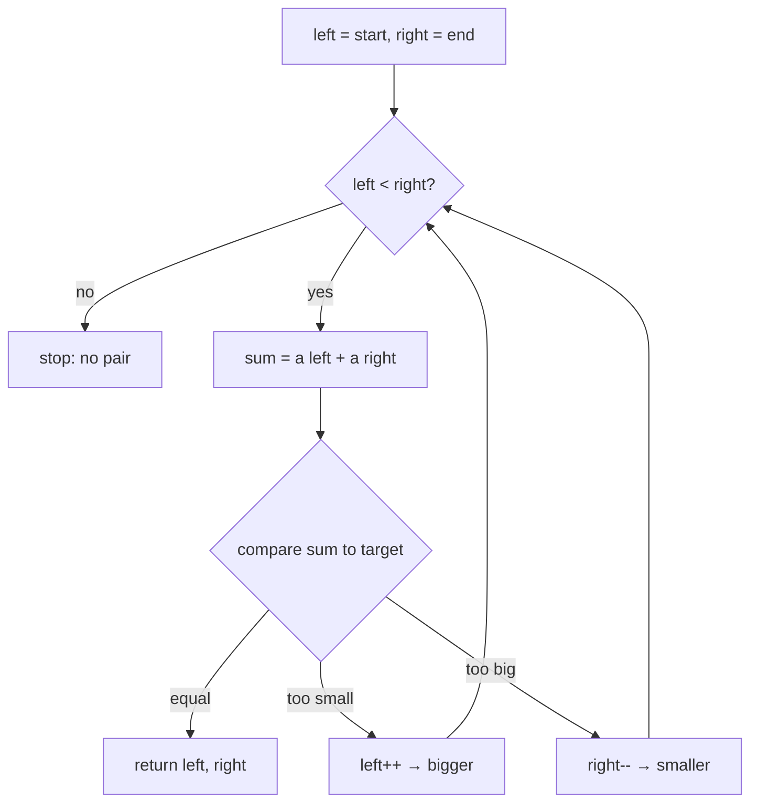

# Two markers from both ends

## 1. What it is
Two pointers, **one at each end of a sorted (or symmetric) list**, walking toward
the middle. Each step you compare, then move the side that gets you closer.

> Built on: **Two Pointers**. The extra rule: the markers start at opposite ends
> and move *inward*; a comparison decides which one moves. This only works when the
> data has order or symmetry — that's what makes the comparison meaningful.

> ⚖️ **Unsorted input? This breaks.** The trick leans entirely on order. If the array
> isn't sorted, reach for the hashmap sibling
> [`hashing/two-sum`](../../hashing/two-sum/README.md) instead. Same question (Two Sum),
> different trick — picked by whether the input is sorted.

## 2. Spot it
**In a problem:**
- a **sorted** array + "find a pair (or triplet) that sums to `X`".
- "is it a palindrome?", "reverse it in place", "most water / max area between two walls".
- the giveaway: being sorted means *too big → shrink from the right; too small → grow from the left.*

**In real code** (reviewing a PR — any stack):
- Frontend: checking a sequence reads the same both ways (palindrome-style validation); reversing an array in place by swapping ends; trimming junk off both ends of a token list.
- Backend: a `left = 0 / right = len - 1` loop that shrinks toward the middle — reversing a buffer in place by swapping ends, two-sided trimming of a sorted range until a condition holds, or a max-between-two-ends scan (container-with-most-water style).
- Smell test: a nested loop over a **sorted** array to find a pair → collapse it to two converging pointers. O(n²) → O(n).

## 3. What you track
- two indices: `left` (start) and `right` (end).
- the comparison each step that tells you which pointer to move.

## 4. How it works
Recipe (Two Sum II — sorted input):
> 1. Put `left` on the first item, `right` on the last.
> 2. Add them: `sum = a[left] + a[right]`.
> 3. `sum === target` → found, return both.
> 4. `sum < target` → you need a bigger total → move `left` right (to a larger number).
> 5. `sum > target` → you need a smaller total → move `right` left (to a smaller number).
> 6. Stop when the markers meet.

**Why it can't miss a pair (the part worth slowing down for):** because the list is
sorted, moving `left` right *only raises* the sum and moving `right` left *only
lowers* it. When the sum is too big, `a[right]` paired with anything still to its left
is **also** too big — so dropping `right` throws away only impossible options. Each
step safely discards a whole row of candidates, so one sweep covers them all.

## 5. Picture


## 6. Two disguises
Same both-ends mechanic, two very different problems.

- **A — LeetCode #167 Two Sum II (sorted)** (numbers): a **sorted**, 1-indexed array;
  return the 1-based positions of the pair that sums to `target`. Mapping: compare the
  end-to-end `sum` against `target` and move the helpful pointer.
- **B — Valid Palindrome** (text): given a string, ignore non-alphanumeric characters
  and case — does it read the same forwards and backwards? Mapping: `left` and `right`
  start at the ends; compare the two characters; **equal → step both inward; different
  → it's not a palindrome.** Contrast worth noticing: the comparison here is *equality*
  (move both) instead of *magnitude* (move one). Same skeleton, different decision.

## 7. Questions to ask
Only the trick-specific ones (generic scoping lives in the repo README):
- "Is the input guaranteed **sorted**? Ascending or descending?" (the whole trick rests on this.)
- "Is the answer 1-indexed or 0-indexed?" (LC #167 is **1-indexed** — a classic slip.)
- "Exactly one pair, or all pairs?" (all pairs → you must skip duplicates.)
- For palindrome: "Which characters count? Is it case-sensitive?"

## 8. Go faster
- Skeleton you keep ready:
  ```ts
  let left = 0;
  let right = n - 1;
  while (left < right) {
    // compare, then move left++ or right--
  }
  ```
- Invariant: **the answer, if it exists, is always inside `[left, right]`.**
- Trick-specific bugs: forgetting the input must be sorted; 1- vs 0-indexing; using
  `left <= right` when you must not pair an element with itself (use `left < right`).
- Say the cost out loud first: **"O(n) time, O(1) space, one pass from both ends."**

---

Solution code (both disguises, fully commented): [`solution.ts`](./solution.ts).
